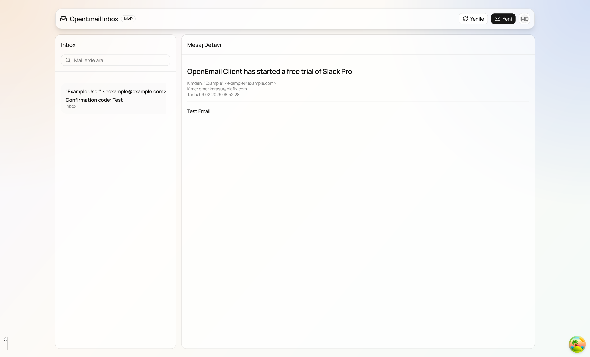

# OpenEmail

Modern bir e-posta istemcisi deneyimi sunmayı hedefleyen full-stack bir uygulama.

- Backend: .NET 8 + FastEndpoints + EF Core + PostgreSQL
- Frontend: Next.js (App Router) + React Query + shadcn/ui
- Kimlik doğrulama: JWT
- Konteyner desteği: Docker ve Docker Compose



## İçindekiler

1. [Proje Özeti](#proje-özeti)
2. [Mimari](#mimari)
3. [Teknoloji Yığını](#teknoloji-yığını)
4. [Hızlı Başlangıç (Yerel Geliştirme)](#hızlı-başlangıç-yerel-geliştirme)
5. [Docker ile Çalıştırma](#docker-ile-çalıştırma)
6. [Ortam Değişkenleri](#ortam-değişkenleri)
7. [API Uç Noktaları](#api-uç-noktaları)
8. [Klasör Yapısı](#klasör-yapısı)
9. [Katkı ve Lisans](#katkı-ve-lisans)

## Proje Özeti

OpenEmail, bir e-posta hesabına bağlanıp gelen kutusunu görüntüleme, mesaj detayına erişme ve yeni e-posta gönderme akışlarını sağlayan bir uygulamadır. Proje, temiz katmanlı backend mimarisi ile modern bir Next.js arayüzünü bir araya getirir.

## Mimari

Sistem iki ana parçadan oluşur:

- OpenEmail-Backend: API katmanı, uygulama katmanı, domain modeli ve altyapı bileşenleri
- OpenEmail-Frontend: kullanıcı arayüzü, oturum yönetimi ve API entegrasyonları

Backend içerisinde katmanlar:

- OpenEmail.Api: HTTP endpoint'leri, doğrulama, middleware
- OpenEmail.Application: iş kuralları, use-case akışları, DTO/map işlemleri
- OpenEmail.Domain: domain varlıkları ve enum'lar
- OpenEmail.Infrastructure: veri erişimi, provider entegrasyonları, EF Core

## Teknoloji Yığını

Backend:

- .NET 8
- FastEndpoints
- Entity Framework Core (Npgsql)
- AutoMapper
- JWT Bearer Authentication

Frontend:

- Next.js 16
- React 19
- TypeScript
- @tanstack/react-query
- Tailwind CSS 4
- shadcn/ui ve Radix UI

Altyapı:

- PostgreSQL 16
- Docker / Docker Compose

## Hızlı Başlangıç (Yerel Geliştirme)

### Ön Gereksinimler

- .NET SDK 8+
- Node.js 20+
- npm 10+
- PostgreSQL 16+ (veya Docker)

### 1) Backend

Backend dizinine geçin:

```bash
cd OpenEmail-Backend/OpenEmail.Api
```

Ortam değişkenlerini düzenleyin:

- `OpenEmail-Backend/OpenEmail.Api/.env` dosyasını güncelleyin
- Özellikle `CONNECTION_STRING`, `JWT_SECRET`, `AES_KEY`, `AES_IV`, `IMAP_HOST` değerlerini kendi ortamınıza göre ayarlayın

Uygulamayı başlatın:

```bash
dotnet restore
dotnet build
dotnet run
```

Varsayılan geliştirme adresleri:

- `https://localhost:7233`
- `http://localhost:5210`

Swagger:

- `https://localhost:7233/swagger`

### 2) Frontend

Frontend dizinine geçin:

```bash
cd OpenEmail-Frontend
```

Ortam dosyasını hazırlayın:

```bash
cp .env.example .env.local
```

`.env.local` içinde backend adresini kontrol edin (örnek: `https://localhost:7233/api`).

Bağımlılıkları yükleyip geliştirme sunucusunu çalıştırın:

```bash
npm install
npm run dev
```

Frontend adresi:

- `http://localhost:3000`

## Docker ile Çalıştırma

Kök dizinden tüm servisleri ayağa kaldırın:

```bash
docker compose up --build
```

Servisler:

- Frontend: `http://localhost:3000`
- Backend API: `http://localhost:8080`
- PostgreSQL: `localhost:5432`

Servisleri durdurma:

```bash
docker compose down
```

Volume dahil temiz durdurma:

```bash
docker compose down -v
```

## Ortam Değişkenleri

### Backend (`OpenEmail-Backend/OpenEmail.Api/.env`)

```env
CONNECTION_STRING=Host=localhost;Port=5432;Database=openemail;Username=openemail;Password=openemail
JWT_SECRET=replace-with-a-strong-secret
AES_KEY=32-byte-secret-key-value-goes-here
AES_IV=16-byte-init-vector
IMAP_HOST=your-imap-host
IMAP_SSL=true
```

### Frontend (`OpenEmail-Frontend/.env.local`)

```env
NEXT_PUBLIC_API_BASE_URL=https://localhost:7233/api
NEXT_PUBLIC_LOGIN_ENDPOINT=/auth/signin
NEXT_PUBLIC_INBOX_ENDPOINT=/inbox
NEXT_PUBLIC_EMAIL_DETAIL_ENDPOINT=/emails/{id}
NEXT_PUBLIC_SEND_EMAIL_ENDPOINT=/emails
```

Notlar:

- Frontend, endpoint path'lerini `NEXT_PUBLIC_API_BASE_URL` sonuna ekler.
- Docker Compose ile çalışırken API adresi `http://localhost:8080/api` olarak ayarlanır.

## API Uç Noktaları

Temel endpoint'ler:

- `POST /api/auth/signin` - Giriş ve JWT üretimi
- `GET /api/inbox` - Gelen kutusu listesi
- `GET /api/emails/{id}` - E-posta detayını getirir
- `POST /api/emails` - Yeni e-posta gönderir

Not:

- Sign-in dışındaki endpoint'ler JWT Bearer token bekler.

## Klasör Yapısı

```text
open-email-client/
├── OpenEmail-Backend/
│   ├── OpenEmail.Api/
│   ├── OpenEmail.Application/
│   ├── OpenEmail.Domain/
│   └── OpenEmail.Infrastructure/
├── OpenEmail-Frontend/
├── doc/
├── docker-compose.yml
└── README.md
```

## Katkı ve Lisans

- Katkı rehberi: [CONTRIBUTING.md](CONTRIBUTING.md)
- Davranış kuralları: [CODE_OF_CONDUCT.md](CODE_OF_CONDUCT.md)
- Lisans: [LICENSE](LICENSE)

---

Geri bildirim, öneri ve katkılar için issue veya pull request açabilirsiniz.
